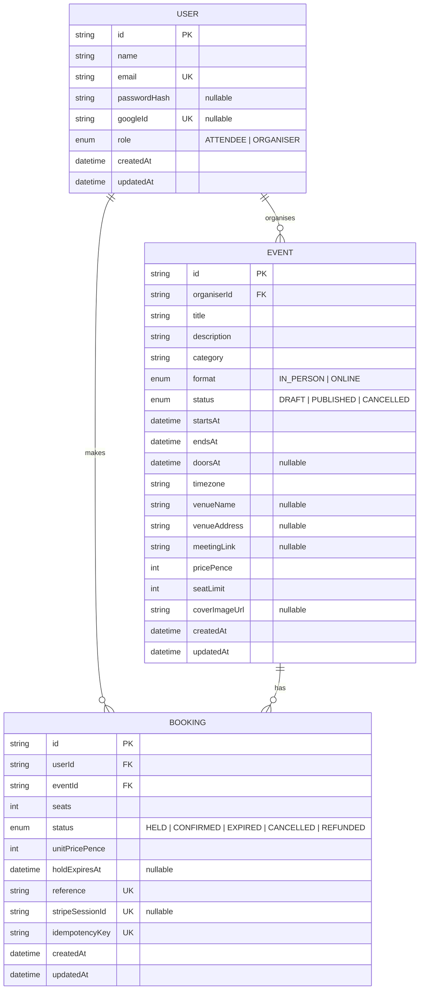

# Database schema

```mermaid
erDiagram
    USER ||--o{ EVENT : "organises"
    USER ||--o{ BOOKING : "makes"
    EVENT ||--o{ BOOKING : "has"

    USER {
        string id PK
        string name
        string email UK
        string passwordHash "nullable"
        string googleId UK "nullable"
        enum role "ATTENDEE | ORGANISER"
        datetime createdAt
        datetime updatedAt
    }

    EVENT {
        string id PK
        string organiserId FK
        string title
        string description
        string category
        enum format "IN_PERSON | ONLINE"
        enum status "DRAFT | PUBLISHED | CANCELLED"
        datetime startsAt
        datetime endsAt
        datetime doorsAt "nullable"
        string timezone
        string venueName "nullable"
        string venueAddress "nullable"
        string meetingLink "nullable"
        int pricePence
        int seatLimit
        string coverImageUrl "nullable"
        datetime createdAt
        datetime updatedAt
    }

    BOOKING {
        string id PK
        string userId FK
        string eventId FK
        int seats
        enum status "HELD | CONFIRMED | EXPIRED | CANCELLED | REFUNDED"
        int unitPricePence
        datetime holdExpiresAt "nullable"
        string reference UK
        string stripeSessionId UK "nullable"
        string idempotencyKey UK
        datetime createdAt
        datetime updatedAt
    }
```

PK = primary key, FK = foreign key, UK = unique.